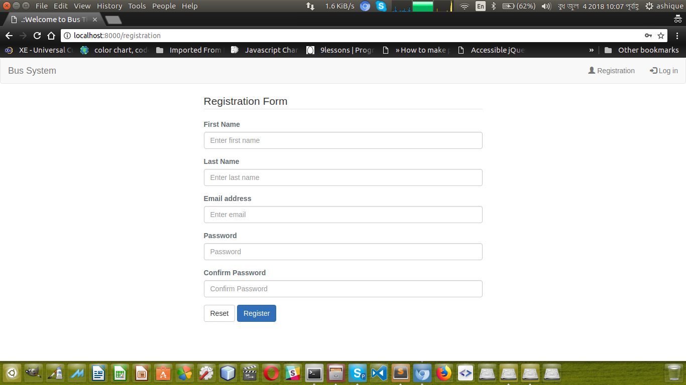
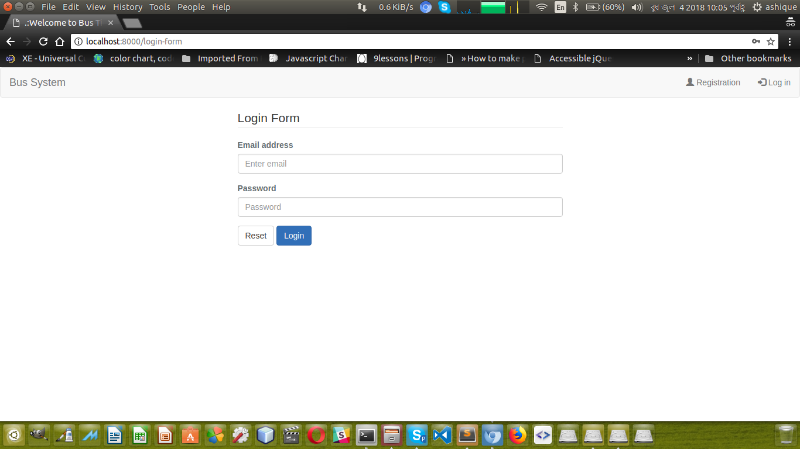
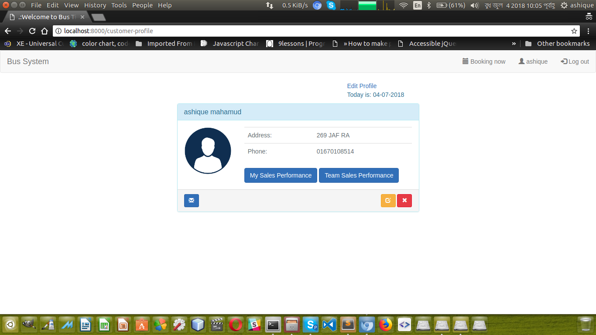

Bus Ticket System

## About Bus Ticket System

A simple bus ticket system made by Larave 5.4.
There are several features here in this project and those are listing below:

- Custom login.
- Custom registration
- 2 types of users (Customer and Admin).
- Credentials: Give you later.
- Customer can edit their profile.
- Customer can booking their seat by choosing from available seat.
- Customer can see bus list and choose which bus is suitable for them.

## Some Screenshots

## registeration

## login

## profil

## edit profile

## booking list

## booking form

## My logo

